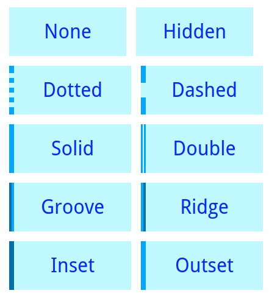
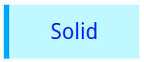

# `border-left-style`

Style of the left border.

Borders are one of the most customizable parts of an element's box model. This **CSS property** sets the style of the left border.

The style is the appearance of the border. Several predefined styles are available to choose.

## Syntax

The value for this property is specified in the *declaration block* of a CSS Rule-set:

```css
selector {
  border-left-style: < none | hidden | dotted | dashed | solid | double | groove | ridge | inset | outset | initial | inherit >;
}
```

### Values

From [w3schools](http://www.w3schools.com/cssref/pr_border-left_style.asp), the allowed values for this properties are the following:
- `none`: Defines no border (default)
- `hidden`: Defines a hidden border
- `dotted`: Defines a dotted border
- `dashed`: Defines a dashed border
- `solid`: Defines a solid border
- `double`: Defines a double border
- `groove`: Defines a 3D grooved border. The effect depends on the border-color value
- `ridge`: Defines a 3D ridged border. The effect depends on the border-color value
- `inset`: Defines a 3D inset border. The effect depends on the border-color value
- `outset`: Defines a 3D outset border. The effect depends on the border-color value
- `initial`: Sets this property to its default value
- `inherit`: Inherits this property from its parent element

This is the appereance of each predefined style:




## Example 1

Set the the left border style of `<div>` elements to `solid`:

```css
div {
  border-left-style: solid;
}
```



## Example 2

Set the the left border style of elements with the class `border-dotted` to `dotted`:

```css
.border-dotted {
  border-left-style: dotted;
}
```


## Special Notes

Note that for `none` and `hidden` values, the size of the box is affected by the absence of border. This behaviour can be modified setting the `box-sizing` property to `border-box` instead of the default `content-box`.